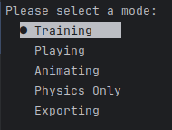

# Newton - Isaac Sim
This repo contains the code and configuration used during our journey of developing Newton using NVIDIA's Isaac Sim and rl games.

## Requirements
- Ubuntu 22.04 LTS (Works with Pop OS as well)
- Nvidia GPU with 510.73.05+ drivers (execute `nvidia-smi` in your terminal to make sure these are set up)
- Isaac Sim (tested with version `4.0.0`)
- Stable Baseline
- Anaconda | Miniconda

## Isaac Sim Setup
- Download Isaac Sim by following the steps found within Nvidia's installation (guide)[https://docs.omniverse.nvidia.com/isaacsim/latest/installation/install_workstation.html].
- Run Isaac sim from the Omniverse application to make sure it runs properly
- Clone this repository `git clone https://github.com/TheNewtonCapstone/newton-isaac-sim`
- Remove any folder named `_isaac_sim`
- Run `cd newton-isaac-sim && ln -s /home/YOUR_NAME/.local/share/ov/pkg/isaac-sim-4.0.0 _isaac_sim`
- Create the conda environment `conda env create -f environment.yml` 

## Repo Structure
- `newton.py`: Main script used for training/testing/exporting models
- `environment.yml`: Project library requirements
- `core/`: Contains all the core functionalities (Simulation, Training, Animation...)
- `assets/`: Contains the assets
- `scripts/`: Contains helper scripts such as the animation keyframe extractor
- `configs/`: Contains the configuration files
- `runs/`: Model checkpoints and summaries will be saved here

### Running Isaac Sim
The entry point of our project is `newton.py`. **Before running your IDE**, you must configure the environment:
- `conda activate isaac-sim`
- `source _isaac_sim/setup_conda_env.sh`

Now with your environment configured, within the same terminal, you can open your desired IDE
- `pycharm` for Pycharm (recommended)
- `code` for VS Code

We have provided a simple CLI to allow you to start training your very own Newton. All you have to do is run `newton.py`!
Here is how it should look like: 

### Training
- execute `python newton.py` and select `training`.
- Models are saved as `runs/{TaskName}/nn/{checkpoint_name}.pth`

### Exporting ONNX
 - execute`python newton.py` and select `Exporting`.
 - Model is exported to `runs/{checkpoint_name}/nn/{task_name}.pth.onnx`
